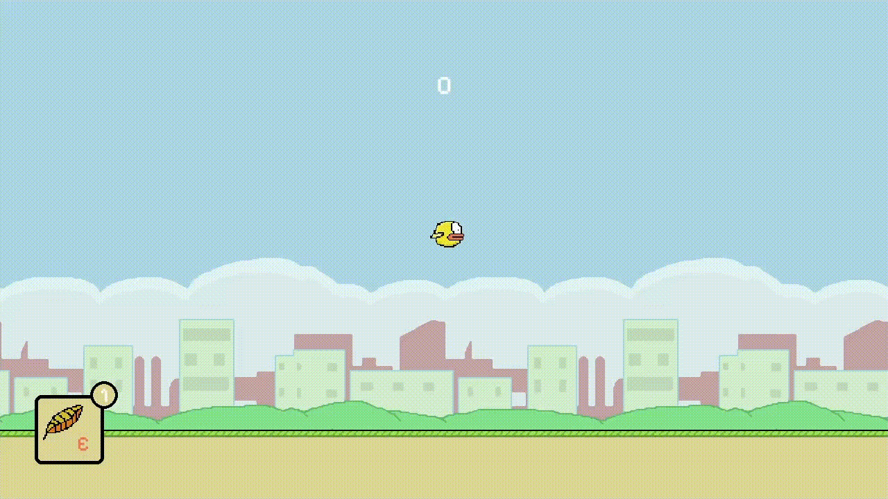

# FlappyBird++

[](https://www.python.org/)

"Physics Accurate" flappy bird with powerups made in [pygame](https://www.pygame.org).

Are you on windows? Grab a copy from the release page.

## How to Setup Code, build and install

### Setup Code

- Install dependencies.

```bash
poetry install --no-root
```

- Activate Virtual Environment.

```bash
poetry shell
```

- Run it

```bash
python main.py
```

### Build and Install

- Run the command below to generate a zip file. **flappybird++.zip**.

```bash
python pyinstaller.py
```

- Move the portable zip file to any location, extract and play.

## Gameplay

Traditional flappy bird, touch to fly, cross the pipe to score. what does that rocket do?


### Powerups

#### Headstart

Zoom through the pipes without interruption for about one second.


#### Guns

Yes, Guns. Shoot down all the pipes in your way.


#### Feather fly

Fly up extra distance (if you need to).



#### Secret within in the game

Dig through the code to find the secret ending.

## Frameworks and credits

- Pygame
- Special thanks to the game dev community on youtube which inspired me to make this project.
